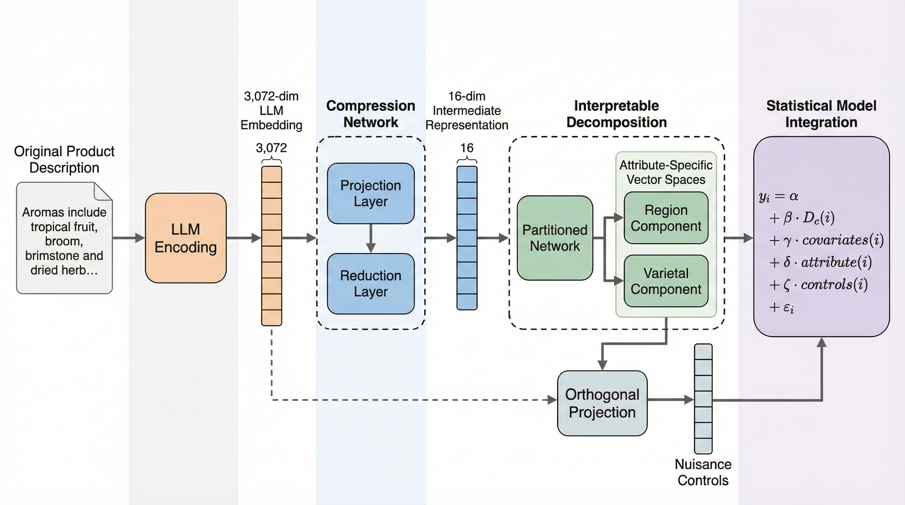

# BRIDGE

**Behavioral Research Through Interpretable, Dimensionality-reduced Generative AI Embeddings**


---



---

## Overview

BRIDGE is a novel analytical method for behavioral research that addresses the stimulus-sampling problem in consumer research by combining foundational AI embeddings with a partitioned deep learning neural network to enable experiments using myriad unaltered real-world product descriptions as stimuli. Specifically, it transforms high-dimensional text embeddings (from models like OpenAI or Gemma) into structured, low-dimensional, **interpretable** attribute-specific representations while simultaneously extracting orthogonal statistical controls for nuisance variables (tone, style, vocabulary, etc.). This enables researchers to examine consumer responses to product attributes while sampling broadly from a large-scale corpus of real-world product descriptions and controlling for unobserved confounds therein.

### Key Features

- **Interpretable embeddings**: Produces separate low-dimensional representations for each attribute (e.g., region, varietal for wines)
- **Nuisance controls**: Extracts orthogonal dimensions capturing stylistic variation not explained by attributes
- **Dual embedding backends**: Supports OpenAI API (3072-dim) or local Gemma (768-dim, free)
- **Contrastive learning**: Uses InfoNCE-style loss for robust representation learning
- **Hyperparameter tuning**: Integrated Optuna-based Bayesian optimization
- **High-level and low-level APIs**: Simple pipeline interface or granular module access
- **Domain-agnostic**: Works with any domain (wine, coffee, products, etc.)
- **Export for downstream analysis**: Produces `.npy` files compatible with R and other tools

### Paper

For methodological details and empirical validation, see our paper:

> **Behavioral Research Through Interpretable, Dimensionality-reduced Generative AI Embeddings (BRIDGE): A Method to Incorporate Real-World Stimuli in Consumer Experiments**
>
> Anirban Mukherjee, Hannah H. Chang, and Sachin Gupta

---

## Installation

### From Source (Development)

```bash
# Clone the repository
git clone https://github.com/dranirbanmukherjee/bridge.git
cd bridge

# Install in development mode
pip install -e "."

# With all optional dependencies
pip install -e ".[all]"
```

### Dependencies

```bash
# For local Gemma embeddings (recommended, free)
pip install sentence-transformers

# For OpenAI embeddings
pip install openai

# For hyperparameter tuning
pip install optuna
```

---

## Quick Start

```python
from bridge import BRIDGEPipeline

# Initialize pipeline with attributes of interest
pipeline = BRIDGEPipeline(
    attributes=["region", "varietal"],
    output_dir="./bridge_output"
)

# Fit on your data
pipeline.fit(
    descriptions=df["description"],
    labels={
        "region": df["province"],
        "varietal": df["variety"]
    }
)

# Get attribute-specific embeddings
embeddings = pipeline.transform()
print(embeddings["region"].shape)    # (n_samples, 8)
print(embeddings["varietal"].shape)  # (n_samples, 8)
print(embeddings["nuisance"].shape)  # (n_samples, 5)

# Export for downstream analysis
pipeline.export()
```

---

## Usage Examples

### High-Level API (BRIDGEPipeline)

The `BRIDGEPipeline` class provides a scikit-learn-style interface:

```python
from bridge import BRIDGEPipeline, BRIDGEConfig
from bridge.data import load_data, clean_data, create_composite_field

# Load and prepare data
df = load_data("winemag-data-130k-v2.csv")
df = clean_data(df, description_col="description", remove_duplicates=True)
df = create_composite_field(
    df,
    columns=["country", "province"],
    new_col="country_province",
    separator="#####"
)

# Initialize and fit pipeline
pipeline = BRIDGEPipeline(
    attributes=["region", "varietal"],
    output_dir="./bridge_output"
)

pipeline.fit(
    descriptions=df["description"],
    labels={
        "region": df["country_province"],
        "varietal": df["variety"]
    },
    tune=True,           # Run Optuna hyperparameter tuning
    n_trials=75,         # Number of tuning trials
)

# Get embeddings
embeddings = pipeline.transform()
region_emb = embeddings["region"]      # (n_samples, 8)
varietal_emb = embeddings["varietal"]  # (n_samples, 8)
nuisance = embeddings["nuisance"]      # (n_samples, 5)

# Export all outputs
pipeline.export()

# Save/load pipeline
pipeline.save("./my_pipeline")
loaded_pipeline = BRIDGEPipeline.load("./my_pipeline")
```

### Low-Level API (Individual Modules)

For advanced users who need granular control:

```python
import numpy as np
from bridge.data import load_data, clean_data
from bridge.encoder import AttributeEncoder
from bridge.embeddings import generate_embeddings
from bridge.array import build_3d_array
from bridge.model import BRIDGEModel
from bridge.training import prepare_data_loaders, tune_hyperparameters, train_model
from bridge.extraction import extract_representations, compute_nuisance_controls

# 1. Load and clean data
df = load_data("data.csv")
df = clean_data(df, description_col="description")

# 2. Encode categorical labels
encoder = AttributeEncoder(["region", "varietal"])
labels = encoder.fit_transform(
    df,
    column_mapping={"region": "province", "varietal": "variety"}
)

# 3. Generate text embeddings
embeddings = generate_embeddings(
    texts=df["description"].tolist(),
    backend="gemma",  # or "openai"
)

# 4. Build 3D contrastive learning array
array_3d = build_3d_array(
    embedding_matrix=embeddings,
    labels=labels,
    mini_batch_size=10,  # 1 anchor + 9 negatives
    seed=42,
)

# 5. Get attribute sizes for model
attribute_sizes = {name: encoder.num_classes(name) for name in ["region", "varietal"]}

# 6. Tune hyperparameters
hp_dict = tune_hyperparameters(
    embeddings=array_3d,
    labels=labels,
    attribute_sizes=attribute_sizes,
    n_trials=75,
)

# 7. Create and train model
model = BRIDGEModel.from_hp_dict(hp_dict)
train_loader, val_loader = prepare_data_loaders(array_3d, labels, batch_size=8)
model, history = train_model(model, train_loader, val_loader, epochs=1000)

# 8. Extract representations
attr_embeddings = extract_representations(model, array_3d)

# 9. Compute nuisance controls
nuisance, interpretable, singular_values = compute_nuisance_controls(
    attribute_embeddings=attr_embeddings,
    full_embedding=embeddings,
    num_nuisance_dims=5,
)
```

### Command-Line Interface

```bash
# Run full pipeline
bridge run --data wine_data.csv \
           --description-col description \
           --attributes region:province varietal:variety \
           --output ./output

# With pre-computed embeddings
bridge run --data wine_data.csv \
           --embeddings embeddings.npy \
           --attributes region varietal

# Skip hyperparameter tuning
bridge run --data wine_data.csv \
           --attributes region varietal \
           --skip-tuning

# Show version
bridge version
```

---

## Architecture

BRIDGE uses a multi-task neural network with contrastive learning:

```
Input: 3D Tensor (batch, mini_batch=10, embedding_dim)
       Position 0: Anchor sample
       Positions 1-9: Negative samples (differ on ALL attributes)
                                     |
                                     v
+-------------------------------------------------------------------------+
|                      EmbeddingTrimmingLayer                              |
|                   (Select first mask_size dimensions)                    |
+-------------------------------------------------------------------------+
                                     |
                                     v
+-------------------------------------------------------------------------+
|                        Projection Layer                                  |
|                  Dense(projection_units) + GELU + Dropout                |
+-------------------------------------------------------------------------+
                                     |
                                     v
+-------------------------------------------------------------------------+
|                        Embedding Layer                                   |
|          Dense(embedding_units_per_attribute * n_attributes)             |
+-------------------------------------------------------------------------+
                                     |
                                     v
+-------------------------------------------------------------------------+
|                          SplitLayer                                      |
|            Split into n_attributes equal parts                           |
+-------------------------------------------------------------------------+
                        |                           |
                        v                           v
          +---------------------+     +---------------------+
          |   Region Branch     |     |  Varietal Branch    |
          |   (8 dimensions)    |     |   (8 dimensions)    |
          +---------------------+     +---------------------+
                |         |                 |         |
     +----------+         +--------+--------+         +---------+
     v                             v                            v
+----------+              +---------------+              +----------+
|TakeAnchor|              | Contrastive   |              |TakeAnchor|
|  Layer   |              |    Layer      |              |  Layer   |
+----------+              | (InfoNCE Loss)|              +----------+
     |                    +---------------+                   |
     v                                                        v
+----------+                                            +----------+
| Softmax  |                                            | Softmax  |
| (classes)|                                            | (classes)|
+----------+                                            +----------+

Total Loss = Classification Loss (per attribute) + 0.1 * Contrastive Loss
```

---

## API Reference

### Main Classes

| Class | Description |
|-------|-------------|
| `BRIDGEPipeline` | High-level pipeline with fit/transform/export interface |
| `BRIDGEModel` | PyTorch neural network for attribute-specific embeddings |
| `BRIDGEConfig` | Configuration dataclass with all hyperparameters |
| `AttributeEncoder` | Label encoding for categorical attributes |

### Core Functions

| Function | Module | Description |
|----------|--------|-------------|
| `train_model` | `training` | Train model with early stopping and LR scheduling |
| `tune_hyperparameters` | `training` | Optuna-based Bayesian hyperparameter optimization |
| `extract_representations` | `extraction` | Extract attribute embeddings from trained model |
| `compute_nuisance_controls` | `extraction` | Compute orthogonal nuisance dimensions |
| `generate_embeddings` | `embeddings` | Generate text embeddings (OpenAI or Gemma) |
| `build_3d_array` | `array` | Construct contrastive learning input array |

---

## Configuration

### Key Hyperparameters

| Parameter | Default | Description |
|-----------|---------|-------------|
| `embedding_backend` | `"openai"` | Backend: "openai" or "gemma" (auto-selection prefers gemma when available) |
| `projection_units` | `128` | Units in projection layer |
| `embedding_units_per_attribute` | `8` | Embedding dimensions per attribute |
| `mask_size` | tuned | Input dimensions to use |
| `dropout_rate` | `0.125` | Dropout probability |
| `mini_batch_size` | `10` | Contrastive mini-batch (1 anchor + 9 negatives) |
| `contrastive_weight` | `0.1` | Weight for contrastive loss |
| `contrastive_temp` | `0.1` | InfoNCE temperature |
| `num_nuisance_dims` | `5` | Number of nuisance dimensions |
| `seed` | `88` | Global random seed |

---

## Embedding Backends

| Backend | Model | Dimensions | Cost | Notes |
|---------|-------|------------|------|-------|
| `gemma` | embeddinggemma-300m | 768 | Free (local) | Requires `sentence-transformers`; MRL dims: 768, 512, 256, 128 |
| `openai` (config default) | text-embedding-3-large | 3072 | API ($) | Requires API key |

**Note:** When using `backend="auto"` in `generate_embeddings()`, gemma is preferred if `sentence-transformers` is installed.

```python
from bridge.embeddings import generate_embeddings

# Gemma (free, local)
embeddings = generate_embeddings(texts, backend="gemma", device="mps")

# OpenAI (requires OPENAI_API_KEY env var)
embeddings = generate_embeddings(texts, backend="openai")
```

---

## Output Format

```
bridge_output/
├── embeddings/
│   └── full_embedding_{backend}_{dim}.npy    # Full embeddings (n, 768|3072)
├── representations/
│   ├── region_embedding.npy                  # Region representations (n, 8)
│   ├── varietal_embedding.npy                # Varietal representations (n, 8)
│   └── nuisance_embedding.npy                # Nuisance controls (n, 5)
├── model/
│   └── bridge_model.pt                       # Trained model checkpoint
└── metadata/
    ├── encoder.json                          # Label mappings
    ├── hyperparameters.json                  # Tuned hyperparameters
    ├── config.json                           # Pipeline configuration
    └── manifest.json                         # File manifest with checksums
```

### Loading in R

```r
library(RcppCNPy)
library(jsonlite)

region_emb   <- npyLoad("bridge_output/representations/region_embedding.npy")
varietal_emb <- npyLoad("bridge_output/representations/varietal_embedding.npy")
nuisance_emb <- npyLoad("bridge_output/representations/nuisance_embedding.npy")
```

---

## Citation

```bibtex
@article{bridge2025,
  title={Behavioral Research Through Interpretable, Dimensionality-reduced
         Generative AI Embeddings (BRIDGE): A Method to Incorporate Real-World
         Stimuli in Consumer Experiments},
  author={Mukherjee, Anirban and Chang, Hannah H. and Gupta, Sachin},
  year={2025},
}
```

---

## License

This work is licensed under a [Creative Commons Attribution-ShareAlike 4.0 International License (CC BY-SA 4.0)](https://creativecommons.org/licenses/by-sa/4.0/).

Copyright (c) 2025 Anirban Mukherjee, Hannah H. Chang, and Sachin Gupta.

You are free to share and adapt this material for any purpose, even commercially, provided you give appropriate credit and license any derivatives under the same terms. See [LICENSE](LICENSE) for the full text.

---

## Authors

- [**Anirban Mukherjee**](https://www.anirbanmukherjee.com) (anirban@avyayamholdings.com) — Principal, Avyayam Holdings
- [**Hannah H. Chang**](https://profhannahchang.github.io) (hannahchang@smu.edu.sg; *corresponding author*) — Associate Professor of Marketing, Lee Kong Chian School of Business, Singapore Management University
- [**Sachin Gupta**](https://business.cornell.edu/faculty-research/faculty/sg248/) (sg248@cornell.edu) — Henrietta Johnson Louis Professor of Marketing, SC Johnson College of Business, Cornell University

## Acknowledgments

This research was supported by the Ministry of Education (MOE), Singapore, under its Academic Research Fund (AcRF) Tier 2 Grant, No. MOE-T2EP40124-0005.
